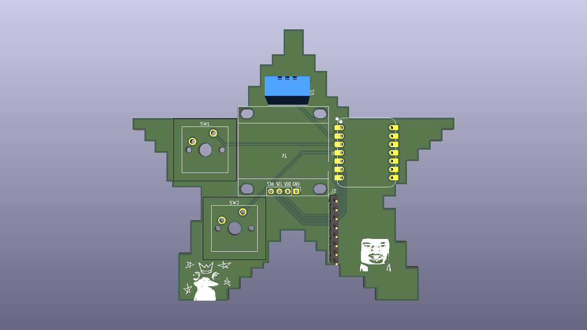

# Starbie - ESP32-C3 Virtual Pet PCB

**Starbie** is a star-shaped interactive desktop companion PCB powered by the Seeed Studio XIAO ESP32C3 microcontroller. Featuring an OLED display, motion/tilt control via an IMU, environmental tracking, and custom tactile buttons, Starbie functions as an animated virtual pet with responsive behaviors and radial menu controls.

---

## Project Structure

```text
starbie/
├── Hardware/        # KiCad PCB design, schematic, and artwork assets
├── Fabrication/     # Gerber & drill files prepared for PCB manufacturing
└── Firmware/        # Arduino firmware (Starbie/Starbie.ino)
```

---

## Hardware Specifications & Bill of Materials

* **Microcontroller:** Seeed Studio XIAO ESP32C3
* **Display:** 0.96" I2C Monochrome OLED Display ($128 \times 64$ resolution, SSD1306)
* **Motion Sensor:** MPU6050 6-Axis Gyroscope & Accelerometer
* **Environmental Sensor:** DHT11 Temperature & Humidity Sensor
* **Input Controls:** 2x Tactile Pushbuttons
* **Pull-up Resistor:** $10\text{k}\Omega$ (0805 or Through-Hole)
* **Form Factor:** Star-shaped PCB outline with custom silkscreen artwork

### Pin Mapping

| Component Net | XIAO Label | ESP32-C3 GPIO | Description |
| :--- | :--- | :--- | :--- |
| **I2C SDA** | `D4` | `GPIO6` | OLED & MPU6050 Data Line |
| **I2C SCL** | `D5` | `GPIO7` | OLED & MPU6050 Clock Line |
| **DHT11 Data** | `D1` | `GPIO3` | Temperature / Humidity Signal |
| **Button 1** | `D2` | `GPIO4` | Menu Trigger / Select |
| **Button 2** | `D3` | `GPIO5` | Stats Screen Toggle |

---

## Software & Flashing Guide

### 1. Requirements & Board Support
1. Download and install [Arduino IDE](https://www.arduino.cc/en/software).
2. Go to **File > Preferences** and add the Espressif Board Manager URL:
   ```text
   https://espressif.github.io/arduino-esp32/package_esp32_index.json
   ```
3. Open **Tools > Board > Boards Manager**, search for `esp32`, and install **esp32 by Espressif Systems**.
4. Set board target under **Tools > Board > esp32 > XIAO_ESP32C3**.

### 2. Required Libraries
Open **Sketch > Include Library > Manage Libraries** and install:
* `Adafruit GFX Library`
* `Adafruit SSD1306`
* `Adafruit MPU6050`
* `DHT sensor library`

*(Select "Install All" if prompted for dependencies).*

### 3. Compiling & Uploading
1. Open `Firmware/Starbie/Starbie.ino` in Arduino IDE.
2. Connect your XIAO ESP32C3 via USB-C and select its COM port under **Tools > Port**.
3. Click **Upload** (`Ctrl + U`).

---

## Controls & Features

* **Button 1 (First Press):** Opens the 4-direction radial menu.
* **Tilt (IMU):** Move the star to direct the selector ball in the radial menu.
* **Button 1 (Second Press):** Confirms the selected action (**NAP**, **PLAY**, **FEED**, **PET**).
* **Button 2:** Toggles the background stats screen (Temperature & Humidity).
* **Shake:** Triggers Starbie's interactive shake reaction.

---

## Customization

You can personalize Starbie's behaviors under the `BEGINNER SETTINGS` block at the top of `Starbie.ino`:
* **Menu Items:** Edit names and stat changes in `MENU_ITEMS[]`.
* **Custom Artwork:** Replace `PET_SPRITE[]` with custom 1-bit byte array bitmaps converted via [image2cpp](https://javl.github.io/image2cpp/).

---

## Starbie PCB Render

